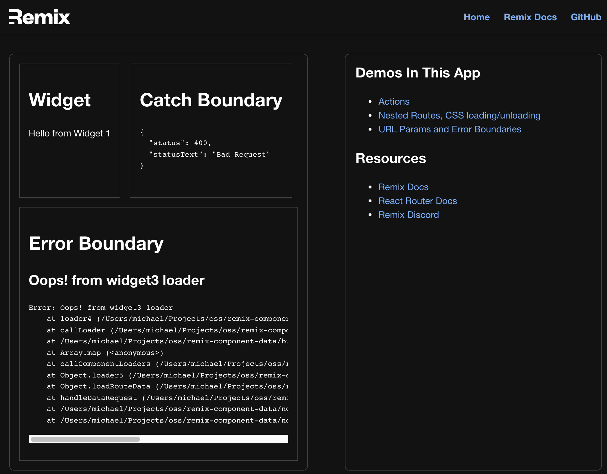

# Remix Component Data



This is a proof of concept for showing how you can expose `loader` and `actions` functions
from your components to use in your routes.

Once the API has settled down, I'll create a NPM package.

View example site at https://remix-component-data.herokuapp.com/

## 🛠 Usage

Your route module still controls the current page's loader. To add component
loaders, you will need to import them manually into your route.

```ts
// route.tsx
import Widget1, { loader as widget1loader } from '~/components/widget1'
import Widget2, { loader as widget2loader } from '~/components/widget2'

// widget1.tsx
export let loader: LoaderFunction = async () => {
  return json({ message: 'Hello from Widget 1' })
}
```

You then need to call these component loaders and return the data with your
existing route loader.

```ts
// route.tsx
import { callComponentLoaders } from '~/utils/remix-component-data'

export let loader: LoaderFunction = async () => {
  // your route's data
  let routeData = { ... }
  // call all component loaders
  const componentData = await callComponentLoaders({
    widget1: widget1Loader,
    widget2: widget2Loader,
  })
  return json({ routeData, componentData })
}
```

You can now access the component data in your default route export. Wrap your
component inside `<ComponentData>` and pass the specific component's data with
the `data` prop.

```ts
// route.tsx
import ComponentData from '~/components/ComponentData'

export default function Index() {
  let { routeData, componentData } = useLoaderData()
  return (
    <div className="widgetContainer">
      {/* Wrap widget in <ComopnentData> and pass in widget loader data */}
      <ComponentData data={componentData.widget1}>
        <Widget1 />
      </ComponentData>
      <ComponentData data={componentData.widget2}>
        <Widget2 />
      </ComponentData>
    </div>
  )
}
```

## 🗂 Accessing Component Loader Data

You can access the loader data for the component using the `useComponentData` hook.
This does not provide access to the route's loader data. You can pass that in
manually using props.

```ts
// widget1.tsx
function Widget1() {
  const { message } = useComponentData()
}
```

## 🏂 Using Component Actions

You can now export actions from your components. As with loaders, the enclosing
route is still responsible for dispatching the action to the component. Once
and action has been successfully handled, Remix will call the route's loaders
as it usually does.

```ts
// route.tsx
export let action: ActionFunction = async args => {
  // call the component actions
  const componentResponse = await callComponentActions(args, {
    // the action id must be unique <ComponentData id={uniqe}>
    // you can add params and this will be matched
    // post?postId=1 will match post?postId
    ['post?postId']: componentAction,
  })
  // check to see if the action was handled
  if (componentResponse.handled) {
    return componentResponse.response
  }
  // if not, process as route action
  return null
}

// wrap component in <ComponentData> and pass in props: id and actionData
export default function () {
  const { routeData, componentData } = useComponentData()
  const actionData = useActionData()
  return (
    <>
      {routeData.postIds
        .map(postId => `post?postId=${postId}`)
        .map(postId => (
          <ComponentData
            id={postId}
            key={postId}
            loaderData={componentData[postId]}
            actionData={actionData?.[postId]}
          >
            <Widget4 />
          </ComponentData>
        ))}
    </>
  )
}
```

```ts
// widget.tsx
// componentParams added to match data from <ComponentData id={key}>
export let action: ActionFunction = async ({ request, componentParams }) => {
  const session = await getSession(request.headers.get('Cookie'))
  // get param value from pattern `post?postId`
  const { postId } = componentParams
  const key = `liked-${postId}`
  const isLiked = session.get(key)
  if (isLiked) {
    session.unset(key)
  } else {
    session.set(key, true)
  }

  return json(
    { message: `You liked Post ${postId}`, isLiked },
    { headers: { 'Set-Cookie': await commitSession(session) } },
  )
}

function Widget4() {
  let { postId, isLiked } = useComponentData()
  const actionData = useComponentActionData()
  if (actionData) {
    isLiked = actionData.isLiked
  }

  return (
    <div className="widget">
      <h1>Post {postId}</h1>
      <div>
        <Form method="post">
          {/* <ComponetData.Params> adds hidden input with unique key */}
          <ComponentData.Params />
          <button type="submit">{isLiked ? 'Unlike' : 'Like'}</button>
        </Form>
      </div>
    </div>
  )
}
```

## 💣 Handling errors

Your component can also have a custom `CatchBoundary` and `ErrorBoundary`. Simply
add it as a property to your default export. Just like a route, you can access the
data using the `useComponentCatch` hook and the `error` prop.

```ts
// widget1.tsx
function Widget1() {}
export default Widget1

Widget1.CatchBoundary = function () {
  const caught = useComponentCatch()
  ...
}
Widget1.ErrorBoundary = function({error}) {
  return <div>{error.message}</div>
}
```

## 🙏 Feedback welcome

Please provide feedback either via Issues or on the Remix Discord. Thanks for
taking a look.
